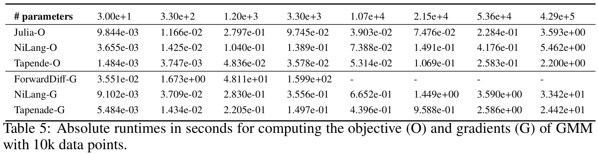

# NiGaussianMixture

Differentiable (reversible) Gaussian Mixture model.

The motivation is to beat the benchmark in this [paper](https://arxiv.org/abs/1807.10129), for the glory of Julia community!

[](https://travis-ci.com/JuliaReverse/NiGaussianMixture.jl)
[](https://codecov.io/gh/JuliaReverse/NiGaussianMixture.jl)

## Get started!

Open a Julia REPL and type `]` to enter `pkg` mode and then type
```julia pkg
pkg> dev git@github.com:JuliaReverse/NiGaussianMixture.jl.git
pkg> add ForwardDiff BenchmarkTools
```

Then in a bash shell, type the following commands to open the benchmark file in Atom.
```bash
$ julia ~/.julia/dev/NiGaussianMixture/benchmarks/benchmark.jl
```

You will see results like:
```julia repl
Normal Objective
BenchmarkTools.Trial: 
  memory estimate:  18.69 MiB
  allocs estimate:  159061
  --------------
  minimum time:     10.997 ms (0.00% GC)
  median time:      11.079 ms (0.00% GC)
  mean time:        11.502 ms (3.30% GC)
  maximum time:     21.625 ms (27.79% GC)
  --------------
  samples:          435
  evals/sample:     1
Reversible Objective
BenchmarkTools.Trial: 
  memory estimate:  8.13 MiB
  allocs estimate:  80211
  --------------
  minimum time:     48.270 ms (0.00% GC)
  median time:      48.512 ms (0.00% GC)
  mean time:        49.078 ms (0.70% GC)
  maximum time:     57.010 ms (12.90% GC)
  --------------
  samples:          102
  evals/sample:     1
NiLang Gradient
BenchmarkTools.Trial: 
  memory estimate:  21.48 MiB
  allocs estimate:  160427
  --------------
  minimum time:     111.399 ms (0.00% GC)
  median time:      113.629 ms (0.00% GC)
  mean time:        113.397 ms (0.86% GC)
  maximum time:     122.746 ms (5.65% GC)
  --------------
  samples:          45
  evals/sample:     1
ForwardDiff Gradient
nparams = 330
BenchmarkTools.Trial: 
  memory estimate:  3.40 GiB
  allocs estimate:  4454076
  --------------
  minimum time:     1.159 s (4.83% GC)
  median time:      1.267 s (11.73% GC)
  mean time:        1.267 s (11.57% GC)
  maximum time:     1.375 s (16.82% GC)
  --------------
  samples:          4
  evals/sample:     1
```

Note: CPU: Intel(R) Xeon(R) Gold 6230 CPU @ 2.10GHz.

It corresponds to the second column of ADBench paper

